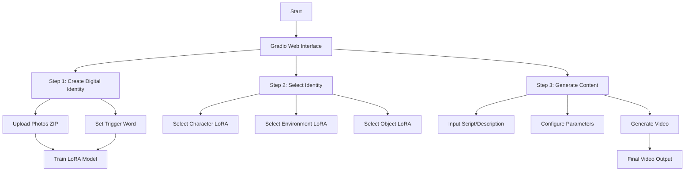
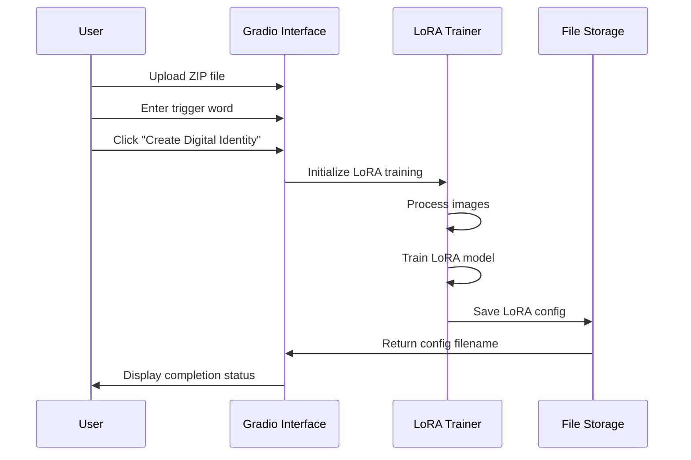
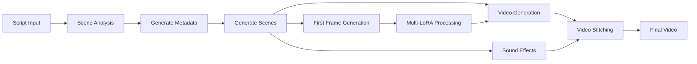
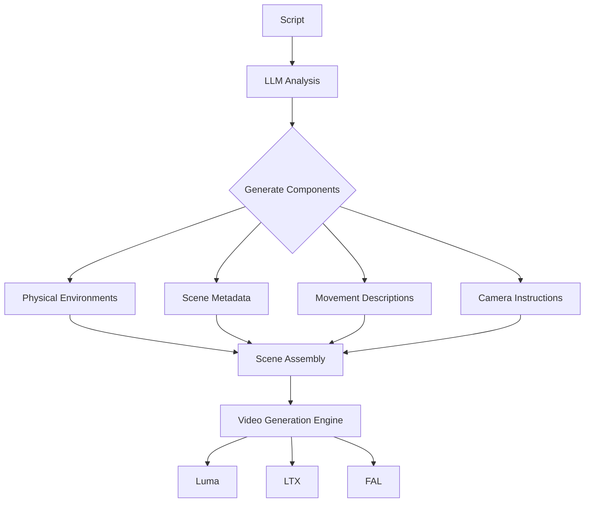
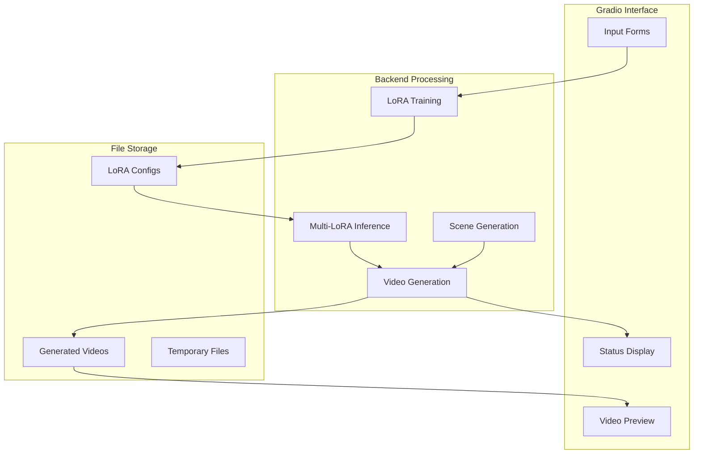

# Smart Influencer Hub - Digital Identity Studio

A powerful AI-powered application that helps create personalized video content using your digital identity. The app combines LoRA training, multi-model video generation, and advanced scene composition to create professional-quality videos.

## Features

- 🎭 **Digital Identity Creation**: Train personalized LoRA models from your photos
- 🎬 **Professional Video Generation**: Create high-quality videos with multiple scenes
- 🎨 **Multi-LoRA Support**: Combine character, environment, and object models
- 🎵 **Audio Integration**: Optional background music and sound effects
- 🤖 **AI-Powered**: Uses multiple AI models (Gemini/Claude) for content generation
- 🎥 **Multiple Video Engines**: Support for Luma, LTX, and FAL video generation

## System Architecture

### 1. High-Level Application Flow



### 2. LoRA Training Process



### 3. Video Generation Pipeline



### 4. Scene Generation Process



### 5. Component Data Flow



## Setup

1. Clone the repository:
```bash
git clone https://github.com/yourusername/elevenlabs-hackathon.git
cd elevenlabs-hackathon
```

2. Install dependencies:
```bash
pip install -r requirements.txt
```

3. Set up environment variables (.env):
```env
ELEVEN_LABS_API_KEY=your_key
GEMINI_API_KEY=your_key
ANTHROPIC_API_KEY=your_key
LUMAAI_API_KEY=your_key
FAL_API_KEY=your_key
```

4. Run the application:
```bash
python lora_video_app_future.py
```

## Usage

1. **Create Digital Identity**:
   - Upload 10-20 professional photos in a ZIP file
   - Set a unique trigger word for your identity
   - Wait for LoRA training completion

2. **Select Identity**:
   - Choose your trained character LoRA
   - Optionally select environment and object LoRAs
   - Load the selected identity configuration

3. **Generate Content**:
   - Write your content description/script
   - Configure scene parameters
   - Choose video quality preset
   - Enable/disable sound effects
   - Generate your professional video

## Technical Components

1. **Frontend**:
   - Gradio web interface
   - Real-time status updates
   - Video preview capabilities

2. **AI Models**:
   - LoRA for fine-tuning stable diffusion
   - Multiple video generation engines
   - LLM integration for content analysis

3. **Processing**:
   - Multi-LoRA inference
   - Scene generation and analysis
   - Video stitching and post-processing

4. **Storage**:
   - LoRA configuration management
   - Generated video storage
   - Temporary file handling

## Requirements

See [requirements.txt](requirements.txt) for a complete list of dependencies.

## Directory Structure

```
elevenlabs-hackathon/
├── lora_video_app_future.py    # Main application file
├── video_generation_reference_future.py  # Video generation logic
├── requirements.txt            # Dependencies
├── .env                       # Environment variables
├── trained_lora_config/       # Trained LoRA models
├── generated_videos/          # Output videos
└── lora_inference_images/     # Generated images
```

## Contributing

Contributions are welcome! Please feel free to submit a Pull Request.

## License

This project is licensed under the MIT License - see the LICENSE file for details.

## Acknowledgments

- ElevenLabs for the hackathon opportunity
- Luma AI for video generation capabilities
- Gradio team for the web interface framework
