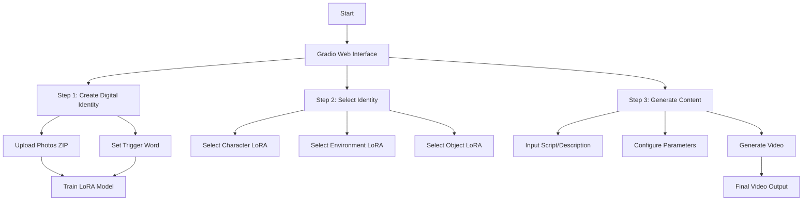
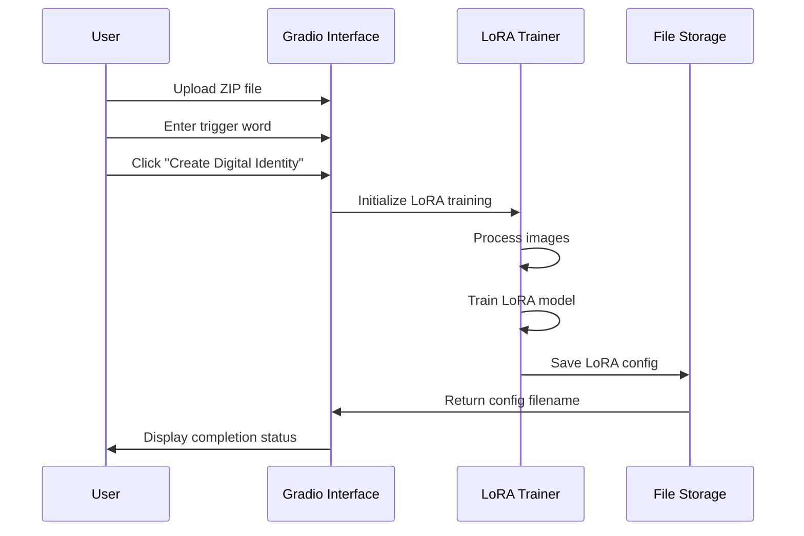
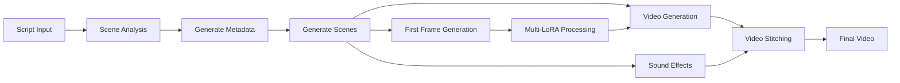
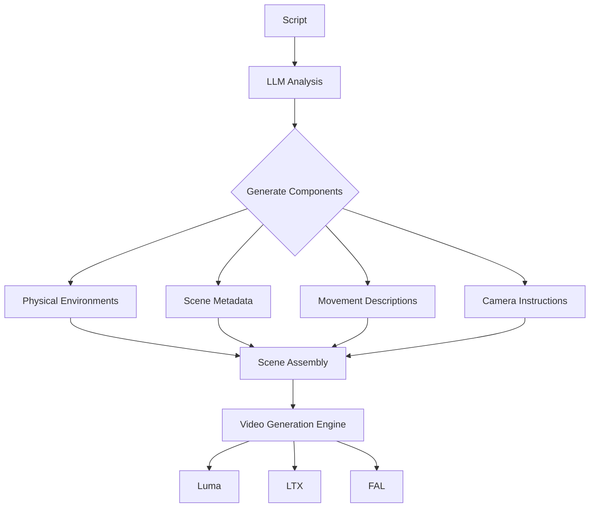
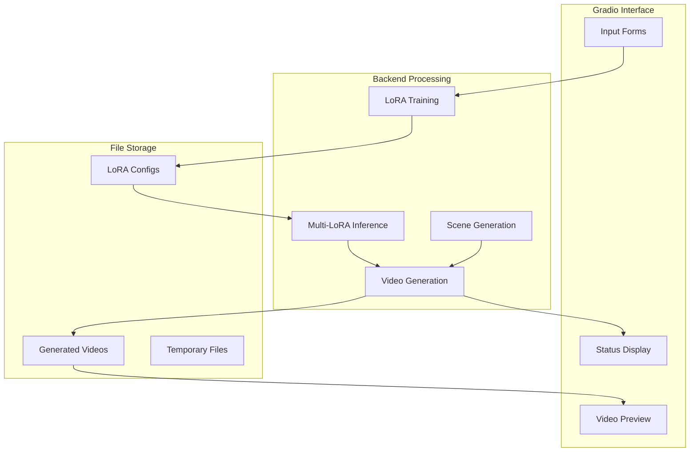

# Smart Influencer Hub - Digital Identity Studio

A powerful AI-powered application that helps create personalized video content using your digital identity. The app combines LoRA training, multi-model video generation, and advanced scene composition to create professional-quality videos.

## Features

- 🎭 **Digital Identity Creation**: Train personalized LoRA models from your photos
- 🎬 **Professional Video Generation**: Create high-quality videos with multiple scenes
- 🎨 **Multi-LoRA Support**: Combine character, environment, and object models
- 🎵 **Audio Integration**: Optional background music and sound effects
- 🤖 **AI-Powered**: Uses multiple AI models (Gemini/Claude) for content generation
- 🎥 **Multiple Video Engines**: Support for Luma, LTX, and FAL video generation

## Multi-LoRA Stacking

This application features advanced Multi-LoRA stacking capabilities, allowing you to combine multiple trained LoRA models to create rich, personalized video content:

- **Character LoRA**: Your primary digital identity (required)
- **Environment LoRA**: Custom backgrounds and settings (optional)
- **Object LoRA**: Signature items or props (optional)

The Multi-LoRA system works by:
1. Training separate LoRA models for characters, environments, and objects
2. Combining these models during the first frame generation of each scene
3. Using trigger words to activate each LoRA in the generation prompt
4. Maintaining visual consistency throughout the video

This approach allows for unprecedented creative control and personalization, enabling you to place your digital identity in various settings with signature objects while maintaining a consistent appearance.

## Video Generation Models

The application supports multiple video generation engines, each with different capabilities:

### 1. Luma AI
- **Features**: High-quality video generation with continuity between scenes
- **Duration Options**: 5s, 9s, 14s, or 18s per scene
- **Resolution**: Up to 540p
- **Strengths**: Excellent motion quality and scene transitions
- **Required API Key**: `LUMAAI_API_KEY`

### 2. LTX (Leonardo Diffusion)
- **Features**: Stylistic consistency and artistic quality
- **Duration Options**: 5s or 10s per scene
- **Strengths**: Artistic style and visual coherence
- **Required API Key**: `REPLICATE_API_KEY`

### 3. FAL
- **Features**: Fast generation and good prompt adherence
- **Duration Options**: 5s or 10s per scene
- **Strengths**: Quick turnaround and accurate prompt following
- **Required API Key**: `FAL_API_KEY`

## System Architecture

### 1. High-Level Application Flow



### 2. LoRA Training Process



### 3. Video Generation Pipeline



### 4. Scene Generation Process



### 5. Component Data Flow



## How It Works

### 1. LoRA Training
The application uses FAL's API to train Low-Rank Adaptation (LoRA) models on your uploaded images. This process:
- Extracts key features from your photos
- Creates a lightweight model that captures your unique appearance
- Associates these features with a trigger word you specify
- Saves the trained model for future use

### 2. Scene Generation
When you provide a script or description, the application:
- Uses LLMs (Gemini or Claude) to analyze your content
- Determines optimal scene count and duration
- Generates detailed scene descriptions including:
  - Physical environments
  - Movement descriptions
  - Emotional atmosphere
  - Camera instructions
  - Sound effect prompts

### 3. First Frame Generation
For each scene, the application:
- Combines your selected LoRA models (character, environment, object)
- Generates a detailed first frame using the trigger words
- Ensures your digital identity appears consistently
- Creates a starting point for video generation

### 4. Video Generation
Using the selected video engine, the application:
- Generates video segments based on scene descriptions
- Uses the first frame as a starting point for continuity
- Maintains visual consistency between scenes
- Applies appropriate camera movements and transitions

### 5. Audio Integration
If enabled, the application:
- Generates appropriate sound effects for each scene
- Matches audio duration to video length
- Combines audio and video in the final output

## Setup

1. Clone the repository:
```bash
git clone https://github.com/yourusername/elevenlabs-hackathon.git
cd elevenlabs-hackathon
```

2. Install dependencies:
```bash
pip install -r requirements.txt
```

3. Set up environment variables (.env):
```env
# Required for core functionality
ELEVEN_LABS_API_KEY=your_key  # For sound effects generation
FAL_API_KEY=your_key          # For LoRA training and FAL video generation

# Required for different LLM options
GEMINI_API_KEY=your_key       # For Gemini LLM
ANTHROPIC_API_KEY=your_key    # For Claude LLM

# Required for different video engines
LUMAAI_API_KEY=your_key       # For Luma AI video generation
REPLICATE_API_KEY=your_key    # For LTX video generation
```

4. Run the application:
```bash
python video_app_multi_lora.py
```

## Usage

1. **Create Digital Identity**:
   - Upload 10-20 professional photos in a ZIP file
   - Set a unique trigger word for your identity
   - Wait for LoRA training completion

2. **Select Identity**:
   - Choose your trained character LoRA
   - Optionally select environment and object LoRAs
   - Load the selected identity configuration

3. **Generate Content**:
   - Write your content description/script
   - Configure scene parameters
   - Choose video quality preset
   - Enable/disable sound effects
   - Generate your professional video

## Technical Components

1. **Frontend**:
   - Gradio web interface
   - Real-time status updates
   - Video preview capabilities

2. **AI Models**:
   - LoRA for fine-tuning stable diffusion
   - Multiple video generation engines
   - LLM integration for content analysis

3. **Processing**:
   - Multi-LoRA inference
   - Scene generation and analysis
   - Video stitching and post-processing

4. **Storage**:
   - LoRA configuration management
   - Generated video storage
   - Temporary file handling

## Requirements

See [requirements.txt](requirements.txt) for a complete list of dependencies.

## Directory Structure

```
elevenlabs-hackathon/
├── video_app_multi_lora.py    # Main application file
├── video_generation_reference_multi_lora.py  # Video generation logic
├── multi_lora_inference.py    # Multi-LoRA stacking implementation
├── fal_train_lora.py          # LoRA training implementation
├── luma_video_gen.py          # Luma AI video generation
├── ltx_video_generation.py    # LTX video generation
├── fal_video_gen.py           # FAL video generation
├── eleven_labs_tts.py         # ElevenLabs sound effects generation
├── requirements.txt           # Dependencies
├── .env                       # Environment variables
├── trained_lora_config/       # Trained LoRA models
├── generated_videos/          # Output videos
└── lora_inference_images/     # Generated images
```

## Contributing

Contributions are welcome! Please feel free to submit a Pull Request.

## License

This project is licensed under the MIT License - see the LICENSE file for details.

## Acknowledgments

- ElevenLabs for the hackathon opportunity
- Luma AI for video generation capabilities
- Replicate for LTX video generation
- FAL AI for LoRA training and video generation
- Gradio team for the web interface framework
