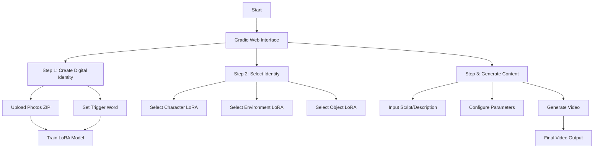
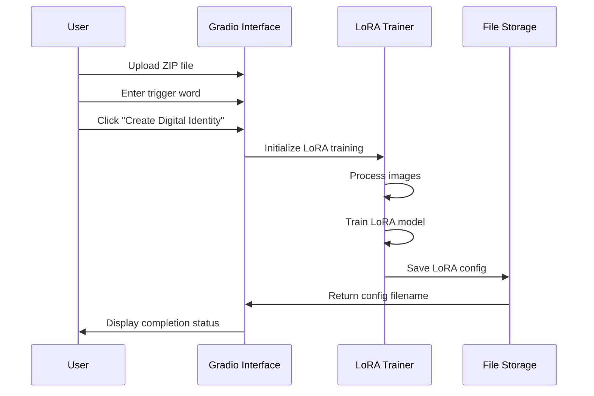
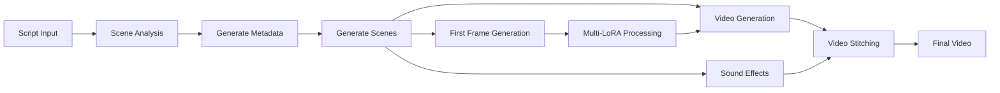
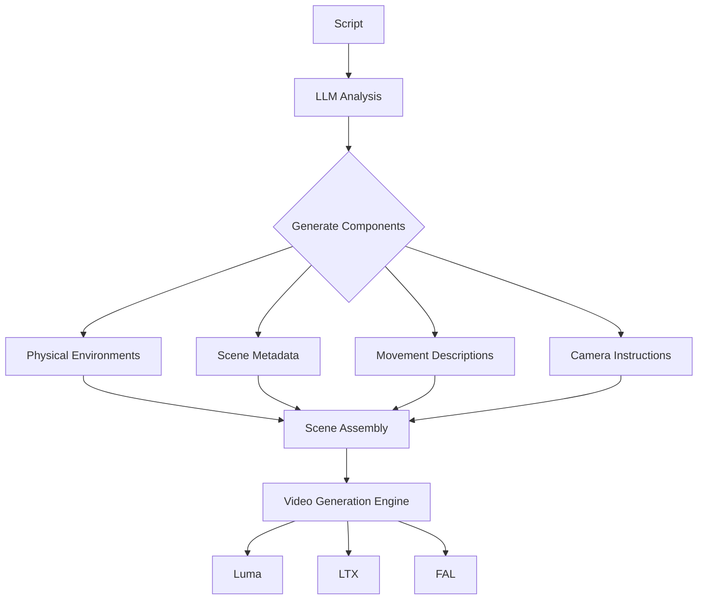
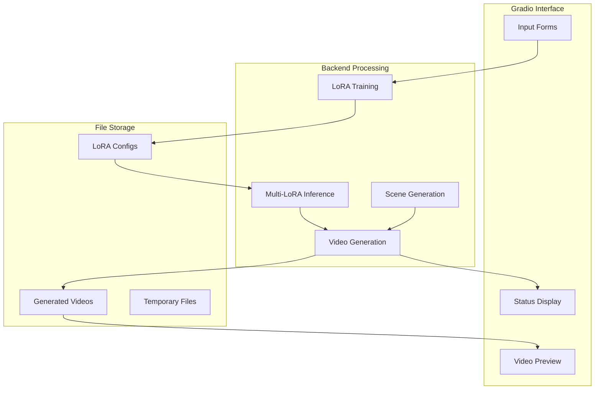

# Smart Influencer Hub - Digital Identity Studio Flow Diagrams

This document outlines the various flows and components of the Smart Influencer Hub application using Mermaid diagrams.

## 1. High-Level Application Flow
This diagram shows the main components and user interaction flow of the application.

## 2. LoRA Training Flow
This sequence diagram illustrates the process of training a new LoRA model from user-provided images.

## 3. Video Generation Pipeline
This diagram shows how the video generation process flows from script input to final output.

## 4. Scene Generation Process
This flowchart details how scenes are generated from the input script.

## 5. Component Data Flow
This diagram illustrates how data flows between different components of the system.

## Technical Components Summary

The application integrates several key technologies:

1. **Frontend**:
   - Gradio web interface for user interaction
   - Real-time status updates
   - Video preview capabilities

2. **AI Models**:
   - LoRA for fine-tuning stable diffusion models
   - Multiple video generation engines (Luma, LTX, FAL)
   - LLM integration (Gemini, Claude) for content analysis

3. **Processing**:
   - Multi-LoRA inference for enhanced image generation
   - Scene generation and analysis
   - Video stitching and post-processing

4. **Storage**:
   - LoRA configuration management
   - Temporary file handling
   - Generated video storage

The system is designed with modularity in mind, allowing for easy updates and component replacements while maintaining the core workflow. 